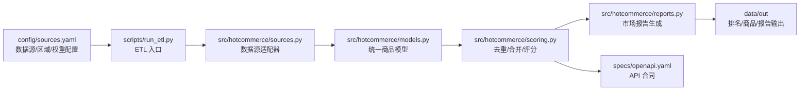

# TrendScout Commerce

**中文** | [English](#english)

TrendScout Commerce 是一个面向区域电商热点商品发现的 ETL 与商品情报框架。它的目标是融合 Google Trends、Reddit、TikTok、Amazon 等多源信号，追踪过去一年 Top 500 和过去 1 个月 Top 200 的潜力畅销商品，并为每个商品生成固定格式的市场报告与未来展望。

当前版本已经跑通完整框架，默认使用 mock adapter，因此不需要 API key 也能本地运行。真实数据源接入时，只需要替换 `src/hotcommerce/sources.py` 中的数据源适配器。

## 项目定位



## 功能

- 多源商品信号抽取框架
- 区域化商品候选池
- 月度 Top 200 和年度 Top 500 榜单
- 多维度热度/畅销评分函数
- 固定格式市场报告和未来展望报告
- OpenAPI 3.1 接口规范
- GitHub Actions 每月定时运行

## 快速开始

```powershell
python -m venv .venv
.\.venv\Scripts\Activate.ps1
pip install -e .
$env:PYTHONPATH='src'
python scripts/run_etl.py --config config/sources.yaml --window month --top-n 20
python scripts/run_etl.py --config config/sources.yaml --window year --top-n 50
```

macOS / Linux:

```bash
python -m venv .venv
source .venv/bin/activate
pip install -e .
export PYTHONPATH=src
python scripts/run_etl.py --config config/sources.yaml --window month --top-n 20
python scripts/run_etl.py --config config/sources.yaml --window year --top-n 50
```

## 输出

默认输出目录是 `data/out`：

```text
data/out/products_<window>.jsonl
data/out/rankings_<window>.json
data/out/reports_<window>.md
```

其中：

- `products_*.jsonl`：标准化商品数据，每行一个商品
- `rankings_*.json`：榜单输出，适合 API 或前端读取
- `reports_*.md`：商品市场分析与未来展望报告

## 数据源

| Source | 用途 | 当前状态 |
| --- | --- | --- |
| Google Trends | 搜索兴趣、区域趋势、同比/环比 | mock adapter，预留正式 API |
| Reddit | 用户讨论、痛点、情绪、社区扩散 | mock adapter，预留 OAuth API |
| TikTok | 短视频热度、标签传播、内容速度 | mock adapter，预留 Research/Commercial API |
| Amazon | 商品排名、类目、品牌、商业信号 | mock adapter，预留 Creators API / PA-API |

API key 可参考 `.env.example`，真实部署时建议放入 GitHub Actions secrets 或云服务密钥管理系统。

## 评分函数

TrendScout Commerce 不把“畅销”简单等同于 Amazon 排名，而是融合多源信号：

```text
score =
  0.30 * commerce_rank_score
+ 0.25 * search_trend_score
+ 0.20 * social_velocity_score
+ 0.10 * sentiment_score
+ 0.10 * regional_fit_score
+ 0.05 * recency_score
```

权重定义在 `config/sources.yaml`。生产环境中建议按类目单独校准权重，因为美妆、电子、家居、服饰等品类的热度滞后和转化逻辑不同。

## OpenAPI Spec

`specs/openapi.yaml` 定义未来 API 服务的边界：

- `GET /rankings`
- `GET /products/{product_id}`
- `GET /products/{product_id}/report`
- `POST /etl/runs`

它不是当前 ETL 的必需运行文件，而是给前端、后台服务、自动化 agent 或第三方系统使用的接口合同。

## GitHub Actions

`.github/workflows/monthly-etl.yml` 会在每月 1 日 09:00 UTC 自动运行，也可以在 GitHub Actions 页面手动触发。

流程：

```text
checkout repo
setup Python
pip install -e .
run monthly ETL
run yearly ETL
upload data/out as artifact
```

## 项目结构

```text
.github/workflows/       GitHub Actions 定时任务
config/                  数据源、区域、窗口、评分权重配置
docs/                    设计文档
schemas/                 商品和报告 JSON Schema
scripts/                 命令行入口
specs/                   OpenAPI 规范
src/hotcommerce/         ETL 核心代码
data/out/                本地运行输出，默认不提交到 GitHub
```

## 官方资料参考

- Google Trends API alpha: https://developers.google.com/search/apis/trends
- Reddit API docs: https://www.reddit.com/dev/api/
- TikTok Research API: https://developers.tiktok.com/products/research-api/
- Amazon PA-API migration notice: https://webservices.amazon.com/paapi5/documentation/

---

## English

TrendScout Commerce is an ETL and product intelligence framework for discovering regional e-commerce hot products. It is designed to combine signals from Google Trends, Reddit, TikTok, Amazon, and other commerce/social sources to track the top 500 products over the past year and the top 200 products over the past month.

The current version runs end to end with mock adapters, so it works without API keys. Real integrations can be added by replacing the adapters in `src/hotcommerce/sources.py`.

## What It Does

- Extracts product signals from multiple source adapters
- Builds a regional product candidate pool
- Produces monthly Top 200 and yearly Top 500 rankings
- Scores products with a multi-signal ranking function
- Generates fixed-format market and outlook reports
- Provides an OpenAPI 3.1 contract for future API services
- Runs monthly through GitHub Actions

## Quick Start

```bash
python -m venv .venv
source .venv/bin/activate
pip install -e .
export PYTHONPATH=src
python scripts/run_etl.py --config config/sources.yaml --window month --top-n 20
python scripts/run_etl.py --config config/sources.yaml --window year --top-n 50
```

Windows PowerShell:

```powershell
python -m venv .venv
.\.venv\Scripts\Activate.ps1
pip install -e .
$env:PYTHONPATH='src'
python scripts/run_etl.py --config config/sources.yaml --window month --top-n 20
python scripts/run_etl.py --config config/sources.yaml --window year --top-n 50
```

## Outputs

The default output directory is `data/out`:

```text
data/out/products_<window>.jsonl
data/out/rankings_<window>.json
data/out/reports_<window>.md
```

## Scoring

The hot-product score combines commerce, search, social, sentiment, regional fit, and recency signals:

```text
score =
  0.30 * commerce_rank_score
+ 0.25 * search_trend_score
+ 0.20 * social_velocity_score
+ 0.10 * sentiment_score
+ 0.10 * regional_fit_score
+ 0.05 * recency_score
```

Weights are configured in `config/sources.yaml`.

## API Contract

`specs/openapi.yaml` defines the future service boundary:

- `GET /rankings`
- `GET /products/{product_id}`
- `GET /products/{product_id}/report`
- `POST /etl/runs`

## GitHub Actions

`.github/workflows/monthly-etl.yml` runs the ETL on the first day of every month at 09:00 UTC. It can also be triggered manually from the GitHub Actions page.

The workflow uploads `data/out` as an artifact after each run.
